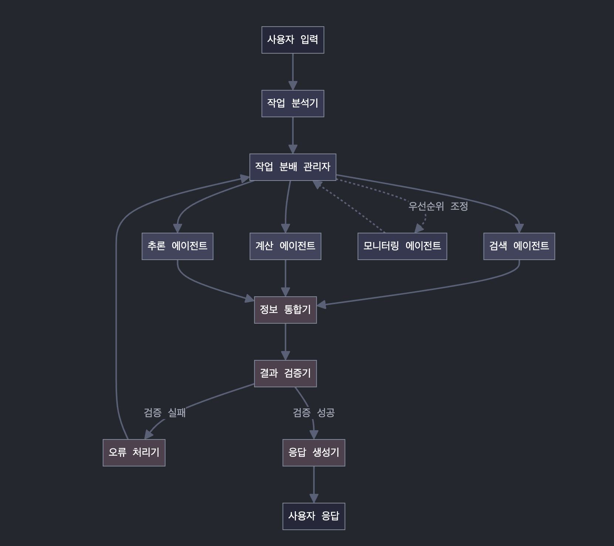

# LLM Agentic Workflows

LLM 기반 에이전트 워크플로우 패턴을 구현한 예제 저장소입니다.



## 구현된 에이전트

### 1. [ReAct 패턴](src/agentic/re-act/docs/re-act.md)

추론(Reasoning)과 행동(Acting)을 번갈아 수행하며 문제를 해결합니다.

### 2. [Self-Reflective 패턴](src/agentic/self-reflective/docs/self-reflective.md)

ReAct 패턴에 반성(Reflection) 단계를 추가하여 결과를 평가하고 필요시 다시 시도합니다.

## 개발 중인 에이전트

- **Plan and Solve**: 🚧 실행 전 세부 계획을 먼저 수립하는 패턴
- **Deep Research**: 🚧 복잡한 질의에 대한 심층 정보 수집 패턴
- **ReWOO**: 🚧 객체 지향적 연산으로 추론하는 패턴

## 실행 방법

각 에이전트 예제는 `pnpm example` 명령어로 쉽게 실행할 수 있습니다:

```bash
# 모든 예제 탐색 메뉴
pnpm example

# 특정 예제 바로 실행
pnpm example re-act
```

## 테스트용 도구

모든 도구는 테스트 목적으로 구현되었으며 `stupid` 접두어로 표시되어 있습니다:

- `stupidCalculator`: 간단한 사칙연산 수행
- `stupidSearchEngine`: 웹 검색 시뮬레이션
- `stupidStringCounter`: 텍스트 내 문자열 출현 횟수 계산

## 개발 가이드

**새 에이전트 패턴 추가하기**:

- `src/agentic/[패턴-이름]` 디렉토리 생성
- **반드시 `example.ts` 파일 생성** (이 파일이 있어야 `pnpm example` 명령어로 실행 가능)
- `docs/[패턴-이름].md` 문서 작성
