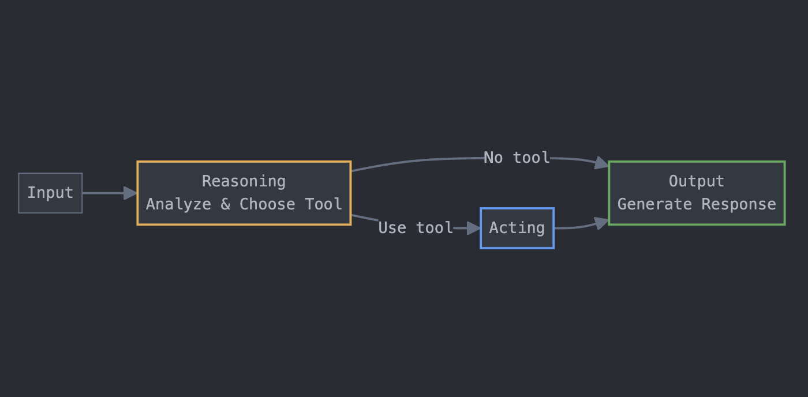

# ReAct 에이전트

## 소개

ReAct(Reasoning + Acting)는 LLM 기반 에이전트가 사고(Reasoning)와 행동(Acting)을 번갈아 수행하며 문제를 해결하는 패러다임입니다. 사용자 질문을 분석하고, 필요시 적절한 도구를 활용하여 효과적인 답변을 제공합니다.

## 노드별 역할

### Input

- 사용자 질문과 사용 가능한 도구 정보를 수집
- 초기 상태(ReactState) 설정 및 워크플로우 시작점

### Reasoning

- 사용자 질문 분석 및 도구 사용 여부 결정
- 도구가 필요한지, 필요하다면 어떤 도구를 사용할지 판단
- 사고 과정(thought)을 생성하고 다음 경로 결정

### Acting

- Reasoning에서 선택된 도구 실행
- 도구 실행에 필요한 입력값 생성
- 도구 실행 결과 수집 및 저장

### Output

- Reasoning과 Acting 결과를 바탕으로 최종 응답 생성
- 도구 사용 여부에 따라 적절한 형태의 응답 제공
- 사용자가 이해하기 쉬운 자연스러운 답변 생성

## 엣지 및 실행 흐름

1. **Input → Reasoning**:

   - 사용자 질문과 도구 정보가 Reasoning 노드로 전달

2. **Reasoning → Output** (No tool):

   - 도구 없이 답변 가능한 경우, 바로 Output 노드로 이동

3. **Reasoning → Acting** (Use tool):

   - 도구 사용이 필요한 경우, Acting 노드로 이동하여 도구 실행

4. **Acting → Output**:
   - 도구 실행 후 결과와 함께 Output 노드로 이동

## 실행 예시

1. 사용자가 "내일 서울의 날씨는 어때?"라고 질문
2. Reasoning: 날씨 정보는 외부 도구 필요 → 날씨 API 도구 선택
3. Acting: 날씨 API에 "서울, 내일" 파라미터로 요청 → 결과 수집
4. Output: "날씨 정보를 확인해보니, 내일 서울은 맑고 기온은 20도로 예상됩니다."

이 단순한 워크플로우를 통해 ReAct 에이전트는 외부 도구를 효과적으로 활용하여 복잡한 질문에도 정확한 답변을 제공할 수 있습니다.
