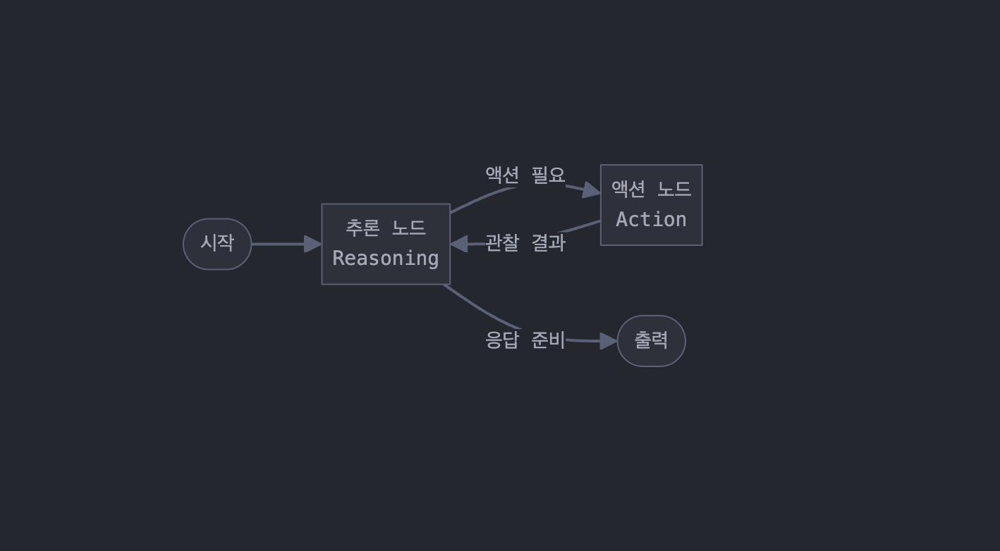

# ReAct 에이전트

ReAct(Reasoning and Acting)는 LLM 기반 에이전트가 추론과 행동을 번갈아가며 문제를 해결하는 패턴입니다. 사용자의 질문에 대해 바로 답변하는 대신, 필요한 정보를 얻기 위해 도구를 사용하고 단계적으로 문제를 해결합니다.

## 노드 구성

### 1. 추론 노드 (Reasoning Node)

- LLM을 사용하여 현재 상황을 분석하고 다음 단계를 결정합니다
- 사용자 질문이 입력된 경우: "다음 문제를 해결하기 위해 어떤 도구가 필요한지 생각해보세요" 같은 프롬프트로 LLM 호출
- 도구 실행 결과가 입력된 경우: "이전 도구 실행 결과를 바탕으로 다음 단계를 결정하세요" 형태의 프롬프트 사용
- 출력: 도구 사용 명령 또는 최종 답변

### 2. 액션 노드 (Action Node)

- 추론 노드에서 결정된 도구를 실행하는 역할
- 도구 이름과 매개변수를 받아 해당 도구 실행
- 도구 실행 결과(관찰 결과)를 생성하여 다시 추론 노드로 전달

### 3. 출력 노드 (Output Node)

- 최종 답변을 사용자에게 반환하는 역할
- 추론 노드가 최종 답변을 생성했을 때 활성화

## 노드 연결 (Edge)

1. **추론 → 액션**: 추론 결과 도구 사용이 필요한 경우
2. **추론 → 출력**: 추론 결과 최종 답변이 준비된 경우
3. **액션 → 추론**: 도구 실행 결과(관찰)가 다시 추론 노드로 전달

## 실행 흐름

1. 사용자 입력을 받아 **추론 노드**에서 시작
2. 추론 노드는 더 많은 정보가 필요하면 **액션 노드**로 이동
3. 액션 노드에서 도구 실행 후 결과를 다시 **추론 노드**로 전달
4. 충분한 정보를 수집했다면 추론 노드는 최종 답변을 만들어 **출력 노드**로 이동
5. 출력 노드에서 사용자에게 답변 반환

이 단순한 구조로 "생각-행동-관찰" 루프를 효과적으로 구현할 수 있습니다.
