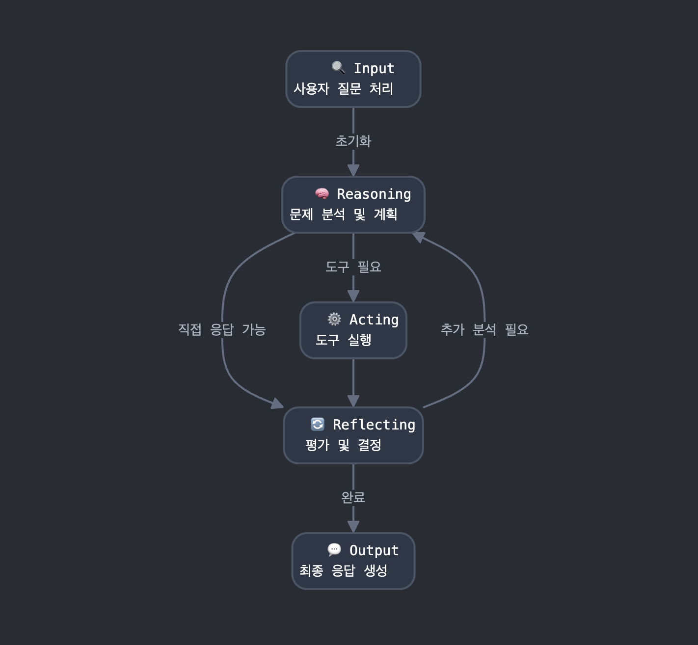

# Self-Reflective 에이전트

## 소개

Self-Reflective 에이전트는 LLM 기반 에이전트가 사고(Reasoning), 행동(Acting), 그리고 반성(Reflecting)을 순환적으로 수행하며 문제를 해결하는 발전된 패러다임입니다. 사용자 질문을 분석하고, 도구를 활용한 후 접근 방식을 평가하여 더 효과적인 답변을 제공합니다.

## 노드별 역할

### Input

- 사용자 질문과 사용 가능한 도구 정보를 수집
- 초기 상태(SelfReflectionState) 설정 및 워크플로우 시작점

### Reasoning

- 사용자 질문 분석 및 도구 사용 여부 결정
- 도구가 필요한지, 필요하다면 어떤 도구를 사용할지 판단
- 사고 과정(thought)을 생성하고 다음 경로 결정

### Acting

- Reasoning에서 선택된 도구 실행
- 도구 실행에 필요한 입력값 생성
- 도구 실행 결과 수집 및 저장

### Reflecting

- 현재까지의 접근 방식 평가
- 추가 정보나 분석이 필요한지 판단
- 도구 사용이 효과적이었는지 평가하고 다음 단계 결정

### Output

- Reasoning, Acting, Reflecting 결과를 바탕으로 최종 응답 생성
- 수집된 정보를 종합하여 사용자 친화적인 답변 형성
- 사용자가 이해하기 쉬운 자연스러운 답변 생성

## 엣지 및 실행 흐름

1. **Input → Reasoning**:
   - 사용자 질문과 도구 정보가 Reasoning 노드로 전달

2. **Reasoning → Reflecting** (No tool):
   - 도구 없이 답변 가능한 경우, Reflecting 노드로 이동

3. **Reasoning → Acting** (Use tool):
   - 도구 사용이 필요한 경우, Acting 노드로 이동하여 도구 실행

4. **Acting → Reflecting**:
   - 도구 실행 후 결과와 함께 Reflecting 노드로 이동

5. **Reflecting → Reasoning** (Need more work):
   - 추가 분석이나 정보가 필요한 경우, Reasoning 노드로 돌아감

6. **Reflecting → Output** (Complete):
   - 충분한 정보를 수집했을 경우, Output 노드로 이동

## 실행 예시

1. 사용자가 "stroberrrrry에 r이 몇 개 있어?"라고 질문
2. Reasoning: 문자 카운팅 도구 필요 → StringCounter 도구 선택
3. Acting: StringCounter에 "stroberrrrry", "r" 파라미터로 요청 → 결과 수집
4. Reflecting: 결과 평가, 추가 정보 필요 없음 → 완료 결정
5. Output: "stroberrrrry에는 r이 5개 있습니다."

이 확장된 워크플로우를 통해 Self-Reflective 에이전트는 외부 도구를 효과적으로 활용할 뿐만 아니라, 자신의 접근 방식을 평가하고 필요시 전략을 조정하여 더 정확하고 신뢰할 수 있는 답변을 제공합니다. 특히 반성(Reflection) 단계를 통해 일회성 도구 사용에 그치지 않고 복잡한 문제도 단계적으로 해결할 수 있습니다.